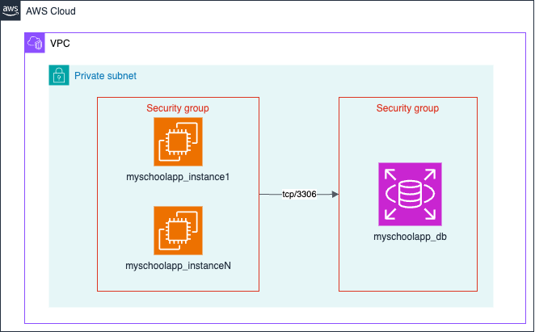

# Sfeir Institute Terraform

## Module 6 - Team Working

### Objective

In this lab, you will have to build your first terraform module to deploy an entire environment for your app MySchoolApp. The application will use a configurable number (*instance_count*) of AWS EC2 instances, of class *ec2_instance_class*, that will need to access an AWS RDS database, with engine *rds_instance_engine* and version *rds_instance_version*. 



The module must be configurable through the following settings :
| Property | Default Value | Configured Value |
| - | - | - |
| my_app_env | - | development | 
| ec2_instance_count | 1 | 2 | 
| ec2_instance_class | t2.micro | t2.micro  | 
| ec2_instance_ami_id | ami-046b5b8111c19b3ac | ami-046b5b8111c19b3ac  | 
| rds_instance_engine | mysql | mysql | 
| rds_instance_version | 8.0.28 | mysql | 
| rds_instance_size | 50G | 20G |
| rds_instance_class | db.t3.micro | db.t3.micro |
| rds_instance_id | - | <your name>_mysqldb |
| rds_instance_user | - | <your name> (sensitive) |
| rds_instance_password | - | <your password> (sensitive) |
| rds_instance_port | 3306 | 3306 |

To simplify the module, the deployment will only use the default VPC of your AWS account and all resources will be in the first VPC subnet. Other resources in your module may be needed to deploy main components (AMI, Security Group...). Note that the DB instance port will have to be opened in the instance security group.

See main.tf to view how your module is expected to be used
See variables.tf to configure your rds instance credentials

Bonus 1 : get and display the connection endpoint of your rds instance using module output

Bonus 2 : the prefered way to ssh connect to an EC2 instance is the EC2 Instance Connect Endpoint. Create the *aws_ec2_managed_prefix_list* datasource and the *aws_ec2_instance_connect_endpoint* resource to enable the secure connection through SSH by pluging the EICE feature to you VCP subnet.

### Check

The lab will be successful if your EC2 instance can connect your RDS database using your credentials :
```bash 
# Install mariadb client
[ec2-user@ip-172-31-33-206 ~]$ sudo dnf install mariadb105 -y
[...]
# Check connection to RDS instance
[ec2-user@ip-172-31-33-206 ~]$ mariadb -h mysqldb.cze4eymgsizp.eu-west-1.rds.amazonaws.com -u cdarcy -p
Enter password: 
Welcome to the MariaDB monitor.  Commands end with ; or \g.
Your MySQL connection id is 27
Server version: 8.0.39 Source distribution

Copyright (c) 2000, 2018, Oracle, MariaDB Corporation Ab and others.

Type 'help;' or '\h' for help. Type '\c' to clear the current input statement.

MySQL [(none)]> 
```